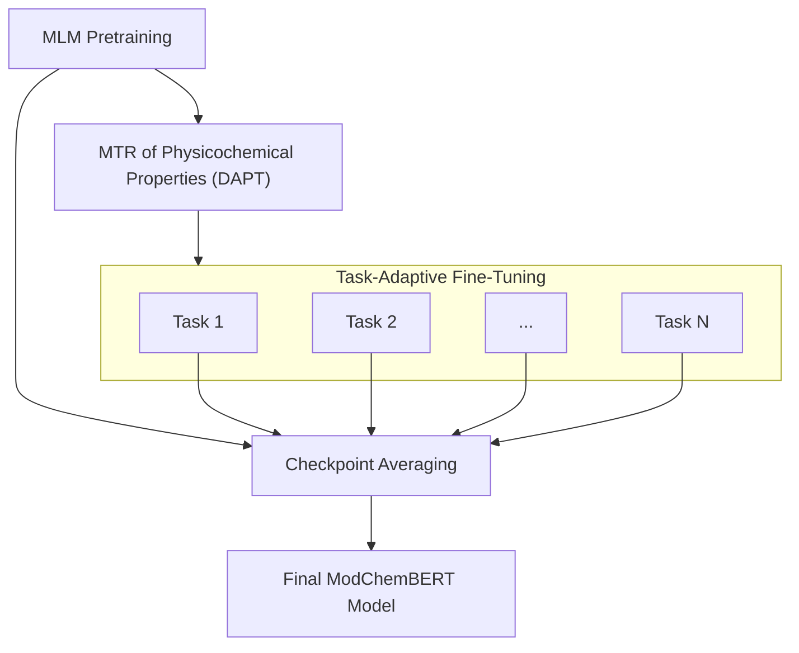

# ModChemBERT: ModernBERT as a Chemical Language Model

## Setup
To install ModChemBERT and its dependencies, run:
```bash
make install
```
This creates a Python virtual environment in the `.venv` directory, installs the required Python packages, and clones the [`chemberta3`](https://github.com/emapco/chemberta3) and [`mergekit`](https://github.com/arcee-ai/mergekit) repositories.

Install flash attention for faster training and to take full advantage of ModernBERT's capabilities:
```bash
MAX_JOBS=4 make install-flash-attention
```
This installs the `flash-attn` package with parallel compilation using 4 CPU cores. Adjust `MAX_JOBS` as needed.
For details, refer to the [flash-attention repository](https://github.com/Dao-AILab/flash-attention).

## ModChemBERT Training Pipeline



### Datasets
### Datasets for Domain-Adaptive Pre-Training (DAPT) and Task-Adaptive Fine-Tuning (TAFT)

Sultan et al. [1] utilized ADME and AstraZeneca datasets for DAPT of BERT-like models on multi-task regression (MTR) following MLM pretraining.

ModChemBERT uses the same datasets for DAPT and TAFT. They are split using DA4MT's scaffold split option. While DA4MT [1] trains various models per dataset, ModChemBERT aggregates all datasets (`all_datasets_smiles`) during DAPT. For TAFT, the MTR model is fine-tuned separately on each dataset, producing 10 fine-tuned models.

#### Dataset Generation
Ensure Git LFS is installed to download the datasets:
```bash
sudo apt-get install git-lfs
git lfs install
```

Pull the datasets (CSV files) from the repository:
```bash
git lfs pull
```

To generate the datasets for MTR pretraining, run:
```bash
make prepare-domain-adaptation-data
```

This creates dataset files in `domain-adaptation-molecular-transformers/data`:
- `{dataset_name}_0.scaffold_splits.json`: contains indexes for train/val/test splits
- `{dataset_name}_mtr.jsonl`: contains physicochemical properties for MTR pretraining
- `{dataset_name}_normalization_values.json`: contains normalization values (mean and std) for each property
- `{dataset_name}.csv`: contains raw data for each dataset used for TAFT

### Datasets for ChemBERTa-3 Benchmarking

ModChemBERT utilizes the ChemBERTa-3 [2] benchmarking framework and datasets to evaluate downstream classification/regression tasks. The datasets use DeepChem scaffold splits for train/val/test partitioning.

#### Dataset Generation
First, clone the ChemBERTa-3 repository:
```bash
make clone-chemberta3
```

Then generate the datasets for ChemBERTa-3 benchmarking:
```bash
make prepare-benchmarking-data
```

This creates task datasets in:
- `chemberta3/chemberta3_benchmarking/data/datasets/deepchem_splits`: Human-readable dataset splits for each task
- `chemberta3/chemberta3_benchmarking/data/featurized_datasets/deepchem_splits`: Dataset splits utilized by ChemBERTa-3 benchmarking framework

### Tokenizer
To train a BPE tokenizer on SMILES strings, run:
```bash
make train-tokenizer
```
Refer to `conf/tokenizer.yaml` for tokenizer training parameters.

You can build a tokenizer from an existing vocabulary by specifying the `from_vocab` and `from_merges` parameters.

### Pretraining
To pretrain ModChemBERT, run:
```bash
make pretrain
```

This performs MLM pretraining using `conf/mlm.yaml`; model parameters are specified in `conf/modchembert-config-mlm.yaml`.

If using a pretrained tokenizer, set its path in `conf/modchembert-config-mlm.yaml` under `modchembert.tokenizer_path`.

#### Hyperparameter Optimization
To perform hyperparameter optimization for MLM pretraining, run:
```bash
make hyperopt
```

Hyperparameter optimization is performed using Optuna and the search space is defined in `conf/hyperopt-mlm.yaml`.

ModChemBERT config hyperparameters to optimize are defined by `hyperopt.hp_space.modchembert_config`. `transformers.TrainingArguments` hyperparameters are set via `hyperopt.hp_space.training_args`.

### Domain-Adaptive Pre-Training (DAPT)
To perform DAPT using multi-task regression (MTR) on physicochemical properties, run:
```bash
make domain-adaptation-mtr MODEL_DIR=training_output/mlm/model_directory
```
Where `MODEL_DIR` is the path to the pretrained ModChemBERT model.

This performs MTR pretraining using `conf/domain-adaptation-mtr.yaml`; model parameters are specified in `conf/modchembert-config.yaml`.

### Task-Adaptive Fine-Tuning (TAFT)
To perform TAFT on each DA4MT task dataset, run:
```bash
python scripts/run_taft_roundrobin.py --num-workers 2 --cuda --pretrained-model-path training_output/model_directory 
```

The `--pretrained-model-path` argument is optional and should point to an MLM or DAPT checkpoint.
You can also set it in `conf/modchembert-config.yaml` under `modchembert.pretrained_model`.

TAFT produces multiple fine-tuned models. Training parameters are set in `conf/task-adaptation-ft.yaml`; model parameters are specified in `conf/modchembert-config.yaml`.

#### Hyperparameter Optimization
To perform hyperparameter optimization for TAFT, enable the hyperopt flag:
```bash
python scripts/run_taft_roundrobin.py --hyperopt --num-workers 2 --cuda --pretrained-model-path training_output/model_directory
```

Hyperparameter optimization is performed using Optuna and the search space is defined in `conf/hyperopt-taft.yaml`.

### Checkpoint Averaging
ModernBERT [3], JaColBERTv2.5 [4], and Llama 3.1 [5] demonstrate that checkpoint averaging (model merging) can yield a more performant final model. JaColBERTv2.5 [4] specifically notes gains in generalization without degrading out-of-domain performance.

ModChemBERT applies checkpoint averaging to integrate learned features from each task-adapted checkpoint and improve generalization.

To perform checkpoint averaging, run:
```bash
mergekit-yaml conf/merge/merge-taft-checkpoints.yaml training_output/model/path --trust-remote-code --copy-tokenizer [--cuda]
cp modchembert/models/modeling_modchembert.py training_output/model/path/
```

This merges TAFT checkpoints using `conf/merge/merge-taft-checkpoints.yaml`. The final merged model is saved to `training_output/model/path`. Add `--cuda` to use GPU.

Copying `modeling_modchembert.py` ensures the model can be loaded with `transformers.AutoModel.from_pretrained()`.

## Classifier Pooling Methods
The ChemLM [6] paper explores pooling methods for chemical language models and finds the embedding method has the strongest impact on downstream performance among evaluated hyperparameters.

Behrendt et al. [7] noted that the last few layers contain task-specific information and that pooling methods leveraging multiple layers can enhance performance. MaxPoolBERT [7] results showed `max_seq_mha` was particularly effective in low-data regimes, while `cls_mha` performed better on larger datasets.

ModChemBERT further explores these pooling methods across DAPT, TAFT, and benchmarking phases.

The available pooling methods are:
- `cls` - Last hidden layer [CLS] token (ModernBERT CLS)
- `mean` - Mean over last hidden layer (ModernBERT Mean)
- `max_cls` - Max over last k [CLS] tokens (MaxPoolBERT MaxCLS)
- `cls_mha` - MHA with [CLS] query (ModernBERT MHA)
- `max_seq_mha` - MHA with max pooled sequence as KV and max pooled [CLS] as query (MaxPoolBERT MaxSeq + MHA)
- `sum_mean` - Sum layers → mean tokens (ChemLM Sum + Mean)
- `sum_sum` - Sum layers → sum tokens (ChemLM Sum + Sum)
- `mean_mean` - Mean layers → mean tokens (ChemLM Mean + Mean)
- `mean_sum` - Mean layers → sum tokens (ChemLM Mean + Sum)
- `max_seq_mean` - Max over last k layers → mean tokens (custom)

## ChemBERTa-3 Benchmarking
Evaluate ModChemBERT on downstream tasks using the ChemBERTa-3 benchmarking framework.

To evaluate on classification tasks, run:
```bash
make eval-classification
```

Configure classification datasets (bace_classification, bbbp, tox21, sider, clintox, hiv), metrics (roc_auc_score, prc_auc_score), and per-dataset hyperparameters in `conf/chemberta3/benchmark-classification.yaml`.

To evaluate on regression tasks, run:
```bash
make eval-regression
```

Configure regression datasets (esol, bace_regression, freesolv, lipo, clearance), metrics (rms_score, mean_squared_error, mean_absolute_error, mae_score), transform options, and per-dataset hyperparameters in `conf/chemberta3/benchmark-regression.yaml`.

### Dataset-specific Hyperparameters
Each dataset has individual training hyperparameters:
- `batch_size`: Training batch size
- `epochs`: Number of training epochs  
- `learning_rate`: Learning rate for fine-tuning
- `classifier_pooling`: Pooling method for the classifier head
- `classifier_pooling_last_k`: Number of last hidden layers to use for pooling
- `classifier_pooling_attention_dropout`: Dropout rate for pooling attention (if applicable)
- `classifier_dropout`: Dropout rate for the classifier head
- `embedding_dropout`: Dropout rate for the embedding layer

### Benchmarking Outputs
Benchmarking logs are saved to `outputs`; model checkpoints go to `training_output/chemberta3-modchembert-ft-models`.

### Hyperparameter Optimization
To perform hyperparameter optimization on a ChemBERTa-3 benchmarking dataset, run:
```bash
.venv/bin/python scripts/train_modchembert.py \
  --config-dir=conf/benchmark-datasets \
  modchembert.pretrained_model=training_output/path/to/model \
  --config-name={dataset_config}
```

Where `{dataset_config}` is the name of a dataset config in `conf/benchmark-datasets` (e.g. `bace_classification.yaml`).

### Analysis
To analyze benchmarking results:
```bash
./scripts/analyze_log_directory.sh outputs/{benchmark_run_log_directory}
```
This script outputs a summary table of validation and test results per task plus overall averages.

## Citation
If you use ModChemBERT in your research, please cite the following:
```bibtex
@software{cortes-2025-modchembert,
  author = {Emmanuel Cortes},
  title = {ModChemBERT: ModernBERT as a Chemical Language Model},
  year = {2025},
  publisher = {GitHub},
  howpublished = {GitHub repository},
  url = {https://github.com/emapco/ModChemBERT}
}
```

## References
1. Sultan, Afnan, et al. "Transformers for molecular property prediction: Domain adaptation efficiently improves performance." arXiv preprint arXiv:2503.03360 (2025).
2. Singh, Riya, et al. "ChemBERTa-3: An Open Source Training Framework for Chemical Foundation Models." (2025).
3. Warner, Benjamin, et al. "Smarter, better, faster, longer: A modern bidirectional encoder for fast, memory efficient, and long context finetuning and inference." arXiv preprint arXiv:2412.13663 (2024).
4. Clavié, Benjamin. "JaColBERTv2.5: Optimising Multi-Vector Retrievers to Create State-of-the-Art Japanese Retrievers with Constrained Resources." Journal of Natural Language Processing 32.1 (2025): 176-218.
5. Grattafiori, Aaron, et al. "The llama 3 herd of models." arXiv preprint arXiv:2407.21783 (2024).
6. Kallergis, Georgios, et al. "Domain adaptable language modeling of chemical compounds identifies potent pathoblockers for Pseudomonas aeruginosa." Communications Chemistry 8.1 (2025): 114.
7. Behrendt, Maike, Stefan Sylvius Wagner, and Stefan Harmeling. "MaxPoolBERT: Enhancing BERT Classification via Layer-and Token-Wise Aggregation." arXiv preprint arXiv:2505.15696 (2025).
